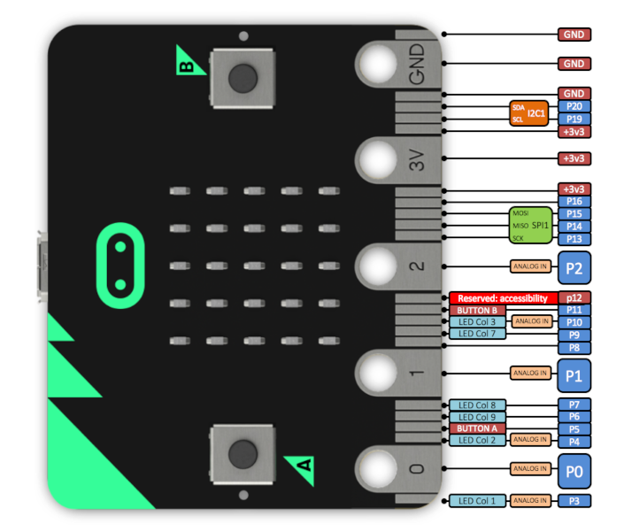
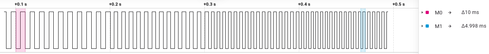
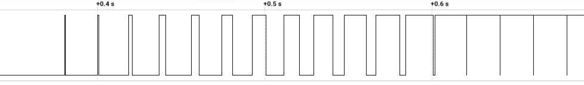
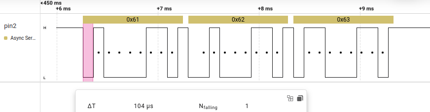
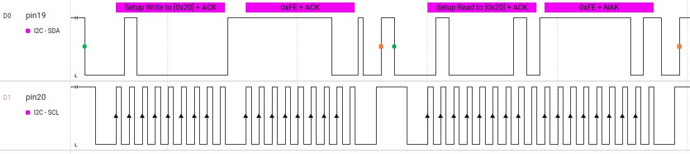

# Programmer la carte *Micro:bit* en C (C++) sous Linux

## Installation

1. Exécutez tout d'abord la commande suivante (Debian):

```bash
sudo apt install gcc git cmake gcc-arm-none-eabi binutils-arm-none-eabi
```

2. Pour Fedora :

```bash
sudo dnf install -y arm-none-eabi-gcc-cs arm-none-eabi-binutils-cs arm-none-eabi-newlib arm-none-eabi-gcc-cs-c++ cmake ninja-build
```

3. Lisez la documentation puis téléchargez le fichier *zip* sur <https://github.com/lancaster-university/microbit-v2-samples>.

> Lien direct : [master.zip](https://github.com/lancaster-university/microbit-v2-samples/archive/refs/heads/master.zip)

Décompressez cette archive.

## Utilisation

1. Renommez le fichier `main.cpp` du répertoire `microbit-v2-samples-master/source` en `main.cpp.old`.
2. Déposez votre propre `main.cpp` dans ce répertoire
3. Positionnez-vous dans le répertoire `microbit-v2-samples-master`
4. Ouvrez un *terminal* et exécutez la commande `python3 build.py`
5. Copiez le fichier `MICROBIT.hex` dans le lecteur MICROBIT

### Script d'automatisation :

```bash
#! /bin/bash

rm MICROBIT.hex
python3 build.py
cp MICROBIT.hex /media/$USER/MICROBIT
```

Ce code *Bash* est à enregistrer dans un fichier nommé (par exemple) ```bad``` (comme **b**uild **a**nd **d**ownload).
Il faut lui donner les droits d'exécution, puis le déposer dans `microbit-v2-samples-master`.

Pour programmer votre *Micro:bit* selon votre code source `main.cpp`, il suffira de taper `./bad`dans la console.

### Port série

Remarque : la communication série entre votre PC et la *Micro:bit* se fait par l'intermédiaire du fichier spécial `/dev/ttyACM0` (par défaut en 115200 bauds)

## Brochage



## Exemples de programmes pour Micro:bit V2 avec [CODAL](images/https://tech.microbit.org/software/runtime/CODAL)

### Boutons-poussoirs et matrice de led

Programme qui affiche :

- **A** sur la matrice de led si le bouton **A** est appuyé
- **B** sur la matrice de led si le bouton **B** est appuyé
- un symbole si les deux boutons sont appuyés
- rien si aucun bouton n'est appuyé

```c
#include "MicroBit.h"

MicroBit uBit;

int main() {
    uBit.init();

    while (true) {
        bool buttonA = uBit.buttonA.isPressed();
        bool buttonB = uBit.buttonB.isPressed();

        if (buttonA && buttonB) {
            // Affiche toutes les LEDs allumées
            MicroBitImage fleche("000,000,000,000,000\n"
                                 "000,255,255,255,000\n"
                                 "255,255,255,255,255\n"
                                 "000,255,255,255,000\n"
                                 "000,000,000,000,000\n");
            uBit.display.print(fleche);
        } else if (buttonA) {
            uBit.display.print("A");
        } else if (buttonB) {
            uBit.display.print("B");
        } else {
            uBit.display.clear();
        }

        uBit.sleep(100);
    }
}
```

### Contrôle du pin 0

Un clignoteur à la fréquence de 1 Hz sur le pin 0.

```c
#include "MicroBit.h"

MicroBit uBit;

int main() {
    uBit.init();
    while (1) {
        uBit.io.P0.setDigitalValue(1);
        uBit.sleep(500);
        uBit.io.P0.setDigitalValue(0);
        uBit.sleep(500);
    }
}
```

Pour lire ce pin en entrée, il suffit d'utiliser :

```c
uBit.io.P0.getDigitalValue();  // lecture booléenne (0 ou 1)
uBit.io.P0.getAnalogValue();   // lecture analogique (0 à 1023)
```

### PWM

Voici un exemple de programme qui utilise la PWM matérielle pour générer un signal carré sur le pin1 avec un rapport cyclique fixe à 50 %, et dont la fréquence (entre 100 et 200 Hz) est mise à jour en fonction de la tension analogique lue sur le pin0.

```c
#include "MicroBit.h"

MicroBit uBit;

int main() {
    uBit.init();
    while (1) {
        int val = uBit.io.P0.getAnalogValue();             // Lecture analogique sur P0 (0-1023)
        int freq = 100 + (val * 100) / 1023;               // Fréquence linéaire entre 100 Hz et 200 Hz
        int period = 1000 / freq;                          // Période en ms (pwm period = 1000/freq)
        uBit.io.P1.setAnalogPeriod(period);                // Configure la période de la PWM sur P1
        uBit.io.P1.setAnalogValue(512);                    // Rapport cyclique à 50% (512 sur 1023)
        uBit.sleep(100);                                   // Pause pour mettre à jour la fréquence
    }
}
```

Résultat obtenu lorsque que la tension sur le pin 0 passe rapidement de **0V** à **3,3V** :



On a effectué deux mesures (en rose et en bleu) montrant bien que la période du signal carré passe bien de 100 Hz à 200 Hz.

### PWM 2

Le signal généré est cette fois-ci de fréquence constante et c'est le **rapport cyclique** qui varie en fonction de la tension appliquée sur le pin 0.

```c
#include "MicroBit.h"

MicroBit uBit;

int main() {
    uBit.init();
    while (1) {
        int val = uBit.io.P0.getAnalogValue();   // Lecture analogique sur P0 (0-1023)
        int period = 10;                         // Période en ms (fréquence 100 Hz)
        uBit.io.P1.setAnalogValue(val);          // Rapport cyclique proportionnel à val
        uBit.sleep(10);                          // Pause pour mettre à jour la fréquence
    }
}
```

Résultat obtenu pour une variation rapide de 0V à 3,3V de la tension appliquée sur le pin 0 :



On observe que la fréquence du signal reste **constante** alors que son **rapport cyclique** évolue entre ces deux extrêmes :

- **0** (pour V<sub>pin0</sub> = 0V)

- presque **1** (pour V<sub>pin0</sub> = 3,3V)
  
  >  *remarque* : le rapport cyclique maximal est de 1023/1024

### Accéléromètre et commande de la matrice de leds

On détecte l'inclinaison de la carte par rapport à l'horizontal (angles *pitch* et *roll*) puis on allume une led représentant cette inclinaison sur la matrice.

```c
#include "MicroBit.h"

MicroBit uBit;

int convAngle(float angle) { // convertit un angle (°) en "coordonnée led"
    if (angle < -90) angle = -90;
    if (angle > 90) angle = 90;
    return (int)round(angle/45 + 2);
}

int main() {
    uBit.init();

    while (1) {
        float pitch = uBit.accelerometer.getPitch();
        float roll = uBit.accelerometer.getRoll();

        // Efface les leds puis allume la bonne
        uBit.display.clear();
        uBit.display.image.setPixelValue(convAngle(roll), convAngle(pitch), 255);

        uBit.sleep(250);
    }
} 
```

### Port série sur pin 2 (TX) et pin 3 (RX) en 9600 bauds

```c
#include "MicroBit.h"

MicroBit uBit;
NRF52Serial ser2(uBit.io.P2, uBit.io.P3);

int main()
{
    uBit.init();
    ser2.setBaudrate(9600);

    while(1)
    {
        ser2.send("abc");  // envoi sur le pin 2
        uBit.sleep(1000);
    }
}
```

Résultat obtenu à l'analyseur logique :



On a mesuré la durée d'un **bit de start**. On obtient **104 µs**, ce qui correspond bien à 1/9600.

### I2C

Contrôle d'un expanseur de port [PCF8574](https://www.ti.com/lit/ds/symlink/pcf8574.pdf)

- Écriture de 0xFE (positionne P0 au niveau bas)

- Lecture

- Écriture de 0xFF (repositionne P0 au niveau haut)

- Lecture

```c
#include "MicroBit.h"

MicroBit uBit;

// Adresse I2C du PCF8574 (à adapter si nécessaire)
const uint8_t adresse_pcf8574 = 0x20;


int main() {
    uBit.init();

    while(1) {
        uint8_t octet_recu;

        // Écriture sur le PCF8574
        uint8_t octet_envoye = 0xFE;
        uBit.i2c.write(adresse_pcf8574 << 1, &octet_envoye, 1);

        // Lecture de l'état des broches
        uBit.i2c.read(adresse_pcf8574 << 1, &octet_recu, 1);

        // Écriture sur le PCF8574
        octet_envoye = 0xFF;
        uBit.i2c.write(adresse_pcf8574 << 1, &octet_envoye, 1);

        // Lecture de l'état des broches
        uBit.i2c.read(adresse_pcf8574 << 1, &octet_recu, 1);
        uBit.sleep(1000);
    }
}
```

Chronogrammes obtenus :



### Multitâche

Programme qui utilise **trois tâches parallèles (fibres)** pour surveiller la température ainsi que les boutons A et B. Il affiche les informations sur le **port série USB**.

```c
#include "MicroBit.h"

MicroBit uBit;

// Tâche 1 : température toutes les trois secondes
void tacheT() {
    while (true) {
        int temp = uBit.thermometer.getTemperature();
        uBit.serial.printf("Température : %d °C\r\n", temp);
        uBit.sleep(3000);
    }
}

// Tâche 2 : bouton A
void tacheA() {
    while (true) {
        if (uBit.buttonA.isPressed())
            uBit.serial.printf("Bouton A\r\n");
        uBit.sleep(1000);
    }
}

// Tâche 3 : bouton B
void tacheB() {
    while (true) {
        if (uBit.buttonB.isPressed())
            uBit.serial.printf("Bouton B\r\n");
        uBit.sleep(1000);
    }
}

int main() {
    uBit.init();

    create_fiber(tacheT);
    create_fiber(tacheA);
    create_fiber(tacheB);

    release_fiber();
    return 0;
```

---

Cette page est mise à disposition selon les termes de la licence 
[Creative Commons Attribution - Pas d’Utilisation Commerciale - Partage dans les Mêmes Conditions 4.0 International](https://creativecommons.org/licenses/by-nc-sa/4.0/).

[](https://creativecommons.org/licenses/by-nc-sa/4.0/)
